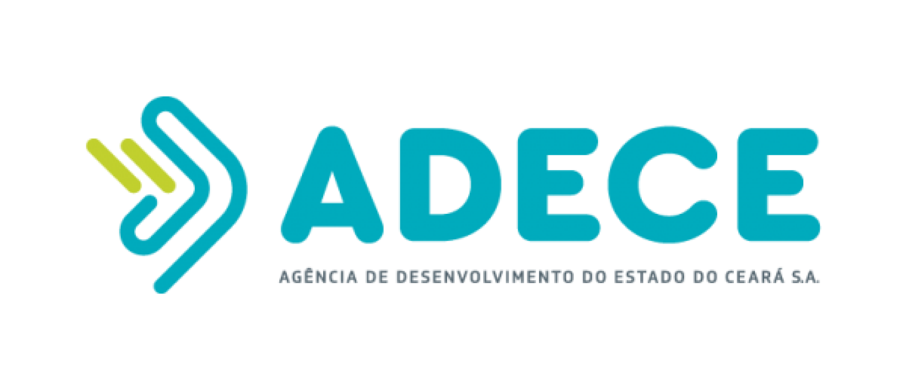

# Digital Store

<div
  style="display: flex; justify-content: space-between;"
>
  
  
  
  
  
</div>

---

This repository is the first test of the course [Geração Tech](https://geracaotech.iel-ce.org.br/)

 A project by the [Euvaldo Lodi Institute](https://www.ielbahia.com.br/) (IEL) and the [Government of the State of Ceará](https://www.ceara.gov.br/) through the [Ceará State Development Agency](https://www.adece.ce.gov.br/) (ADECE) for training young people in technology.

The initiative aims to offer training in Web Development.

# Project
This is the README for the project. You can read it in other languages:

- [README Brazilian Portuguese](docs/README.pt-BR.md)


# 1. Project objective 🤓
This project is a test whose activity is to develop the front-end of a fictitious E-commerce to test web development skills and teamwork.

## 1.1 Technologies used
<!-- 

 -->
[](https://vitejs.dev/)
[](https://react.dev/)
[](https://tailwindcss.com/)
[](https://nodejs.org/)
[](https://git-scm.com/)

# 2. Project structure 📂
-  ``src/`` - Project source code.
- ``components/`` - Reusable React components.
- ``pages/`` - Main e-commerce pages (home, product, cart, checkout, etc.).
- ``src/assets/`` - Images, icons and other static resources.
- ``src/index.css`` - CSS configuration files.
- ``public/`` - Public files accessible directly from the browser.

# 3. Start Project ⌨️
1. Install the latest [LTS version of NodeJS](https://nodejs.org/)
2. Check the installation with the bash commands : ``node -v`` and ``npm -v``
3. Clone this repository with : 
    ```bash
    # HTTPS
    git clone https://github.com/rafaelcesar0/Digital-Store.git
    ```
    or
    ```bash
    # SSH
    git clone git@github.com:rafaelcesar0/Digital-Store.git
    ```
    or do [Download ZIP](https://github.com/rafaelcesar0/Digital-Store/archive/refs/heads/main.zip)
4. Now open the terminal in the project folder and run : 
    ```bash
    npm i # Installs all dependencies
    npm run dev # Execute the project
    ```
# Have fun ! 😁